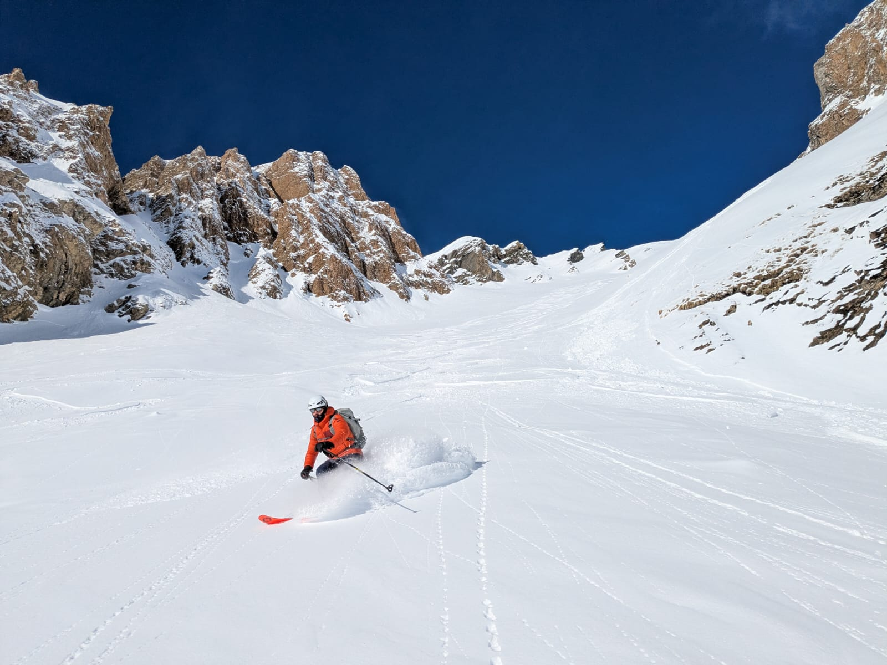
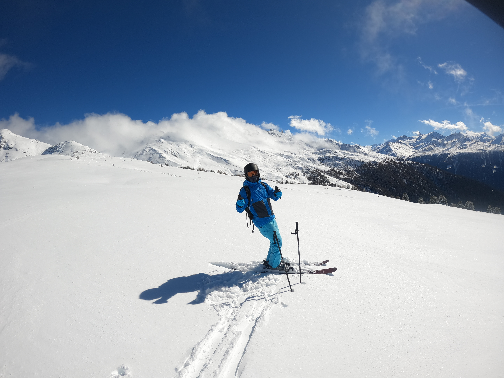
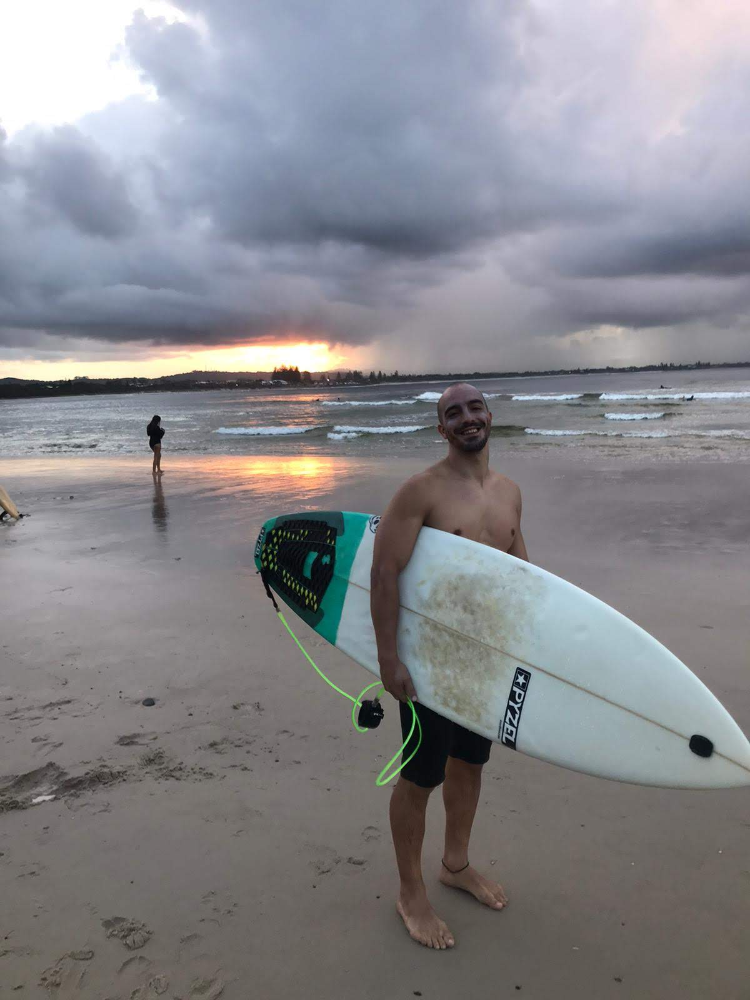
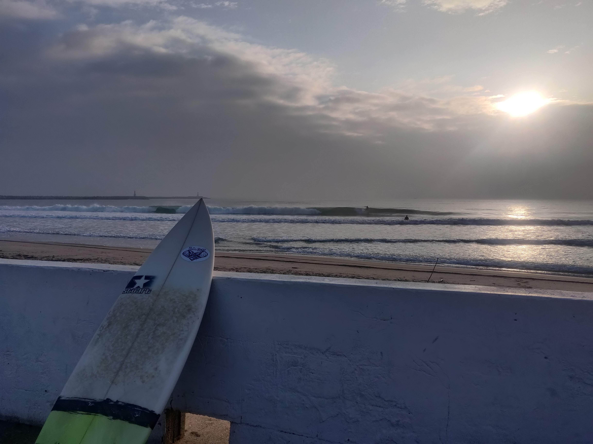
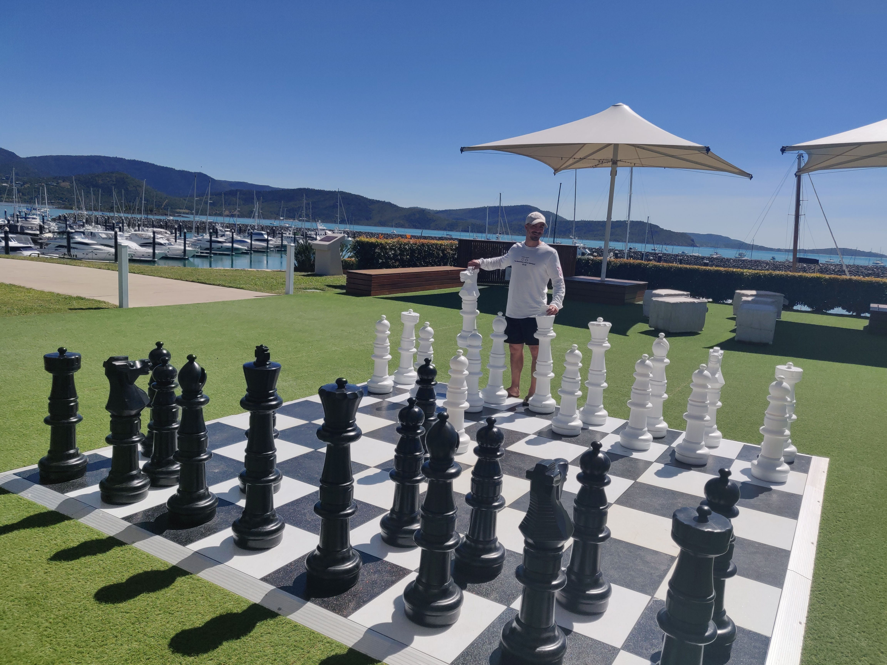

## Mountain Sports

I enjoy all kinds of mountain sports, but I am particularly passionate about skiing, hiking, trekking, and a bit of climbing.

## Water Sports

When I lived in Australia, I learned how to surf, and whenever I get the chance, I love heading to the beach to keep practising this amazing sport. (The first photo is from Byron Bay, Australia.)

## Chess and Video Games

In my free time, I also enjoy sharpening my chess skills and playing video games like Age of Empires II.

