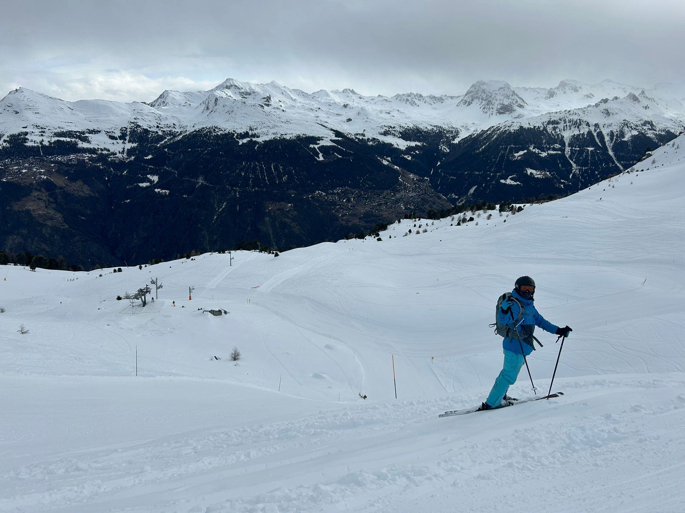
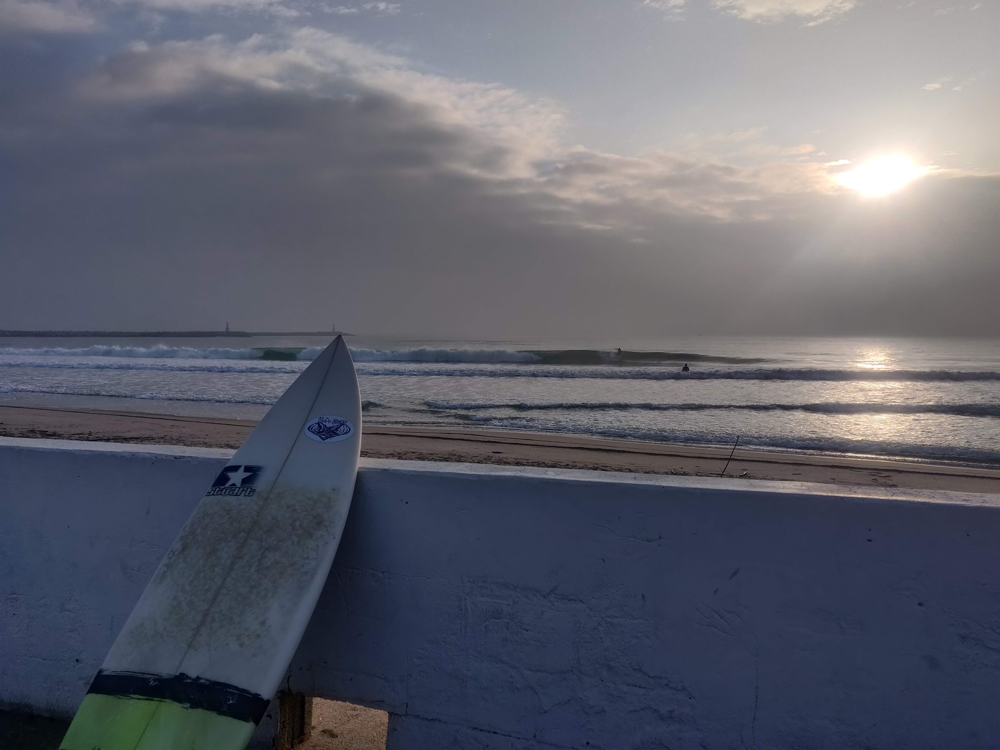

## Mountain sports

I like to practice any kind of mountain sports but I am really in love about skiing, hiking and trekking, and a bit of climbing.

## Water sports

When I lived in Australia I learn how to surf and once in a while I love to go to surf beaches to keep practising this amazing sport. (The first photo is in Australia, Byron Bay).

## Chess and Video games

I love also in my free time improve my chess skills and play some video games like Age of Empires II. 

